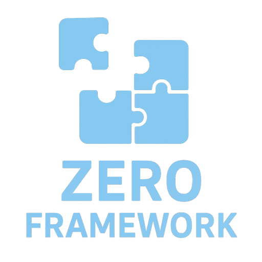

<div align="center">



[](LICENSE)
[](https://github.com/Zero-Point-Maker/ZeroFramework)
[](https://github.com/Zero-Point-Maker/ZeroFramework/issues)
[](https://github.com/Zero-Point-Maker/ZeroFramework)

</div>

# <h1 align="center">Zero Framework</h1>

## 🎯 框架简介

ZeroFramework (简称 ZF) 是一个高度模块化的 Unity 游戏框架，核心优势是**模块可拆卸**，允许开发者根据项目需求灵活选择和组合模块，实现真正的按需使用。

[中文]()|[English](README_EN.md)

## ✨ 核心特性

- **高度模块化**：所有功能以独立模块形式实现，支持按需加载和卸载
- **三级模块体系**：一级核心模块、二级基础模块、三级扩展模块，层次清晰
- **统一模块管理**：通过 `ModuleSystem` 实现模块的统一获取和管理
- **低耦合设计**：模块间通过接口通信，降低模块间依赖
- **易于扩展**：提供清晰的模块扩展机制，支持自定义模块开发
- **高性能**：优化的内存管理和资源加载机制

## 📁 目录结构

```
ZF/
├── Editor/              # 编辑器相关代码
├── Runtime/             # 运行时代码
│   ├── Module/          # 模块实现
│   │   ├── Primary/     # 一级模块（核心功能）
│   │   ├── Secondary/   # 二级模块（基础功能）
│   │   └── Tertiary/    # 三级模块（扩展功能）
└── Setup/               # 框架设置（私人使用，使用者无需关注）
```

## 🚀 快速开始

### 1. 安装框架

将 `ZF` 目录复制到 Unity 项目的 `Assets` 目录下，打开 Unity 编辑器等待自动编译。

### 2. 初始化框架

在游戏入口脚本中初始化框架（参考 `GameEntry.cs`）：

```csharp
using UnityEngine;
using ZF;

public class GameEntry : MonoBehaviour
{
    private void Awake()
    {
        // 获取或创建模块根节点
        var root = ModuleRoot.Instance;
        if (root == null)
        {
            root = new GameObject("ModuleRoot").AddComponent<ModuleRoot>();
        }
        
        // 按需加载模块（根据项目需求选择需要的模块）
        
        // 一级模块（核心功能）
        ModuleSystem.GetModule<IArchitectureModule>();
        ModuleSystem.GetModule<IEventModule>();
        ModuleSystem.GetModule<IFsmModule>();
        ModuleSystem.GetModule<IObjectPoolModule>();
        ModuleSystem.GetModule<ITimerModule>();
        ModuleSystem.GetModule<IUpdateDriver>();
        ModuleSystem.GetModule<IWABModule>();
        
        // 二级模块（基础功能）
        ModuleSystem.GetModule<IDebuggerModule>();
        ModuleSystem.GetModule<IProcedureModule>();
        ModuleSystem.GetModule<IResourceModule>();
        ModuleSystem.GetModule<ISingletonModule>();
        
        // 三级模块（扩展功能，部分需要初始化）
        ModuleSystem.GetModule<IAudioModule>().Initialize(Settings.AudioSetting);
        ModuleSystem.GetModule<IConfigModule>();
        ModuleSystem.GetModule<ILocalizationModule>().Language = root.EditorLanguage;
        ModuleSystem.GetModule<ISceneModule>();
        ModuleSystem.GetModule<IUIModule>();
        
        DontDestroyOnLoad(this);
    }

    private void Start()
    {
        // 启动游戏流程
        Settings.ProcedureSetting.StartProcedure().Forget();
    }
}
```

## 📚 模块使用示例

### 1. 获取模块实例

```csharp
// 通过接口获取模块实例
var eventModule = ModuleSystem.GetModule<IEventModule>();
var timerModule = ModuleSystem.GetModule<ITimerModule>();
var uiModule = ModuleSystem.GetModule<IUIModule>();
```

### 2. 事件系统

```csharp
// 订阅事件
eventModule.Subscribe(EventId.OnGameStart, OnGameStart);

// 发布事件
eventModule.Publish(EventId.OnGameStart, gameData);

// 取消订阅
eventModule.Unsubscribe(EventId.OnGameStart, OnGameStart);

private void OnGameStart(object data)
{
    // 处理游戏开始事件
}
```

### 3. 定时器

```csharp
// 设置延迟执行
timerModule.SetTimeout(2f, () =>
{
    Debug.Log("2秒后执行");
});

// 设置循环执行
timerModule.SetInterval(1f, () =>
{
    Debug.Log("每秒执行一次");
});
```

### 4. UI 系统

```csharp
// 打开窗口
uiModule.OpenWindow<MainWindow>();

// 关闭窗口
uiModule.CloseWindow<MainWindow>();
```

## 📋 模块列表

### 一级模块（核心功能）
- `IArchitectureModule`：架构管理
- `IEventModule`：事件系统
- `IFsmModule`：状态机
- `IObjectPoolModule`：对象池
- `ITimerModule`：定时器
- `IUpdateDriver`：更新驱动
- `IWABModule`：世界-实体-行为系统

### 二级模块（基础功能）
- `IDebuggerModule`：调试器
- `IProcedureModule`：流程系统
- `IResourceModule`：资源管理
- `ISingletonModule`：单例管理

### 三级模块（扩展功能）
- `IAudioModule`：音频管理
- `IConfigModule`：配置管理
- `ILocalizationModule`：本地化
- `ISceneModule`：场景管理
- `IUIModule`：UI 系统

## 💡 最佳实践

1. **按需加载模块**：只加载项目实际需要的模块，避免不必要的性能开销
2. **使用接口通信**：模块间通过接口通信，不要直接依赖具体实现
3. **合理划分模块**：自定义功能时，参考框架的模块划分原则，保持高内聚低耦合
4. **优先使用现有模块**：框架提供的模块已经过优化，优先使用现有模块而非重复造轮子

## 📄 许可协议

MIT 许可协议 - 详细信息请参阅 [LICENSE.md](LICENSE.md)

## 版本历史

详细信息请参阅 [CHANGELOG.md](CHANGELOG.md)

---

**ZeroFramework** - 高度模块化的 Unity 游戏框架，让游戏开发更灵活、更高效！
